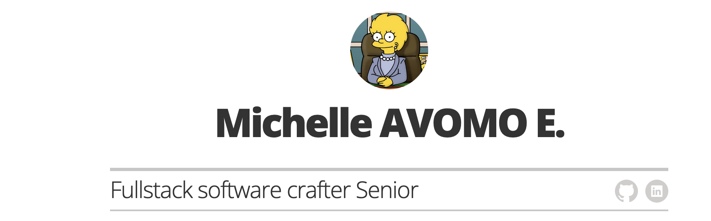

# Resume template

*My CV using Jekyll + GitHub Pages.*

## Docs

### Running locally

To run locally, run the following in your terminal:

1. `bundle install`
2. `bundle exec jekyll serve`
3. Open your browser to `localhost:4000`

### Running locally with Docker

To test locally with docker, run the following in your terminal after installing docker into your system:

1. `docker image build -t resume-template .`
2. `docker run --rm --name resume-template -v "$PWD":/home/app --network host resume-template`

### Publishing to GitHub Pages for free

[GitHub Pages](https://pages.github.com/) will host this for free with your GitHub account. 
I created a `main` branch, and everytime I push a new version, the site will automatically be available at `mavomo.github.io/mylifelong-cv` 
TODO:  Add a custom domain eventually as the CNAME has been updated.

## License

The code was forked from a this [Github Repo](https://github.com/jglovier/resume-template) and styles are licensed under the MIT license. [See project license.](LICENSE)

Disclaimer: As for the initial project, use of Lisa M. Simpson image and name used under [Fair Use](https://en.wikipedia.org/wiki/Fair_use) for educational purposes. Project license does not apply to use of this material.
